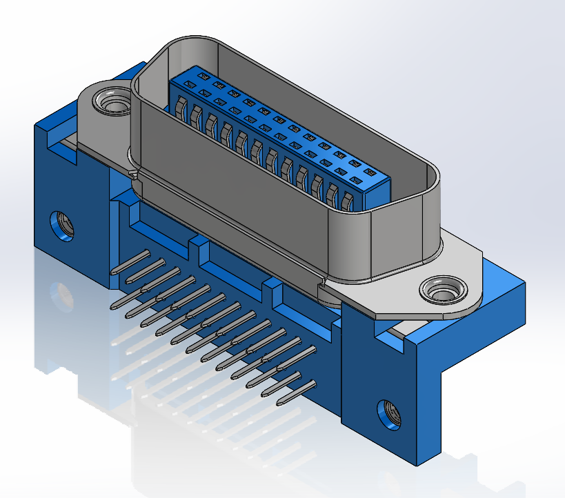

# Centronics HPIB GPIB connector footprints (112-024-113R001)

Footprint and 3d model (with color) of 24 pin centronics GPIB/HPIB/IEEE-488 connector 112-024-113R001. Model is modified from Norcomp [STEP file](https://www.norcomp.net/series/112-series).

